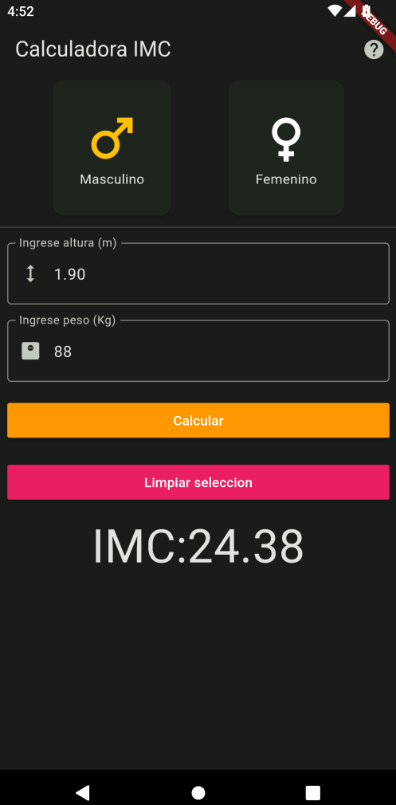

# App BMI calculator

App para practicar:
 - Interacción del usuario
 - Actualizar datos de pantalla
 - Variables y tipos de dato

## Getting Started

Recuerda que despues de clonar el proyecto, abrir una terminal dentro de la carpeta del proyecto y ejecutar el comando:

```sh
flutter packages get
``` 

## App Screenshot


